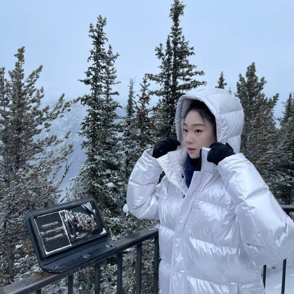

---

I received my undergraduate training in Environmental Biology at the University of Toronto. I am currently pursuing a Master of Sustainability at the University of Sydney and working as a research assistant in environmental health research.
My academic interests focus on environmental health and sustainability, particularly the links between environmental exposures and population health.

---

### Education

* Master of Sustainability, University of Sydney, Sydney, Australia  
* Bachelor of Science in Environmental Biology, University of Toronto, Toronto, Canada

### Information

* Email: <sjia0655@sydney.uni.edu.au>
