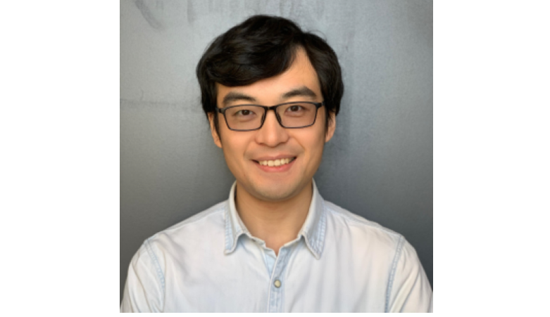
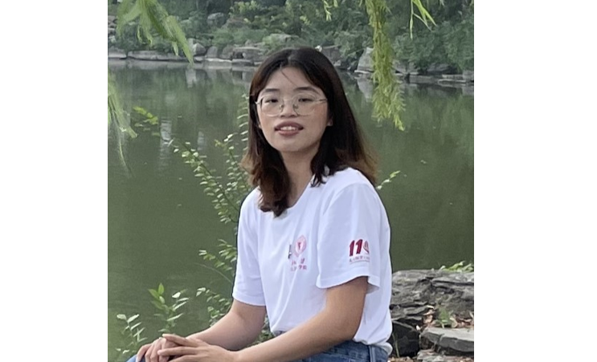
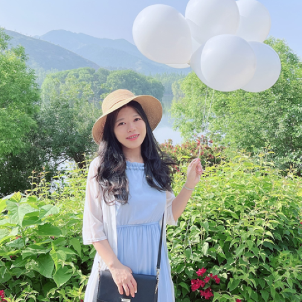
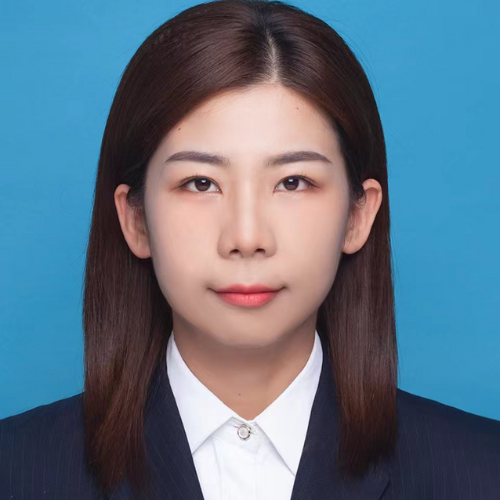
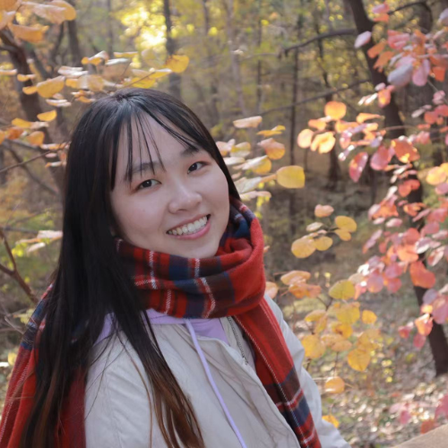
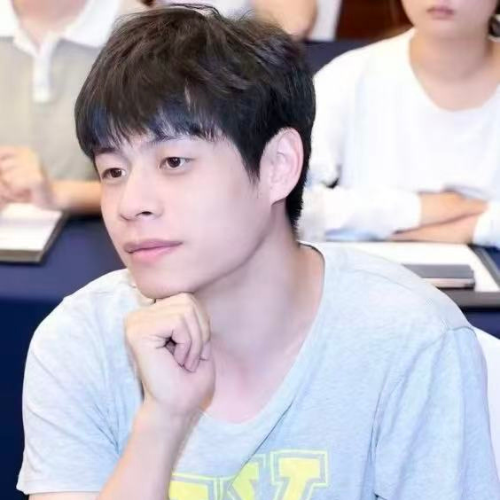
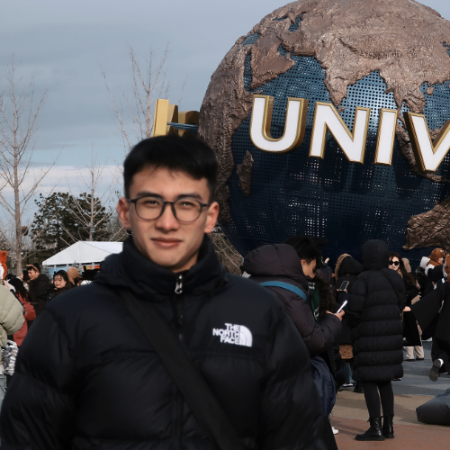
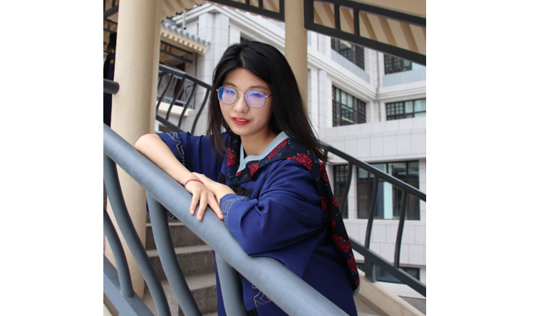
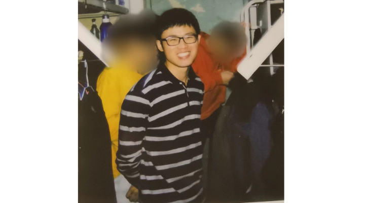
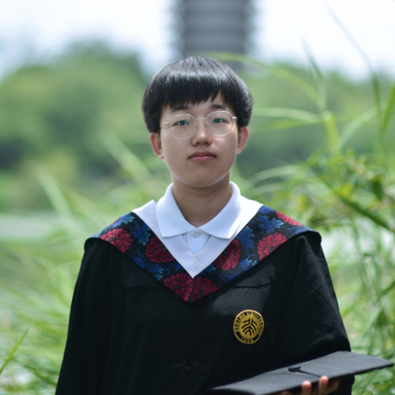

### Xu Gao, Ph.D.
Assistant Professor \
Department of Occupational and Environmental Health Sciences \
School of Public Health, Peking University \
Email: <xu.gao@pku.edu.cn> \
CV: [Xu Gao.pdf](https://github.com/gearpku2020/gearpku2020.github.io/blob/main/CV/CV%20-%20Xu%20Gao.pdf)

**Education**: 
* 2018 - 2020 Postdoctoral Researcher (Environmental Health), Columbia University (United States)
* 2014 - 2018 Ph.D. (Epidemiology, with highest honors summa cum laude), Heidelberg University (Germany)
* 2011 - 2014 Master's degree (Pathogenic Biology), Fudan University (China)
* 2006 - 2011 Bachelor's degree (Preventive Medicine), Fudan University (China)

---

# Team

## Current Members

 |  | 
[
Shuzhen Liu
](../People/Shuzhen-Liu.md) | [
Haocan Song
](../People/Haocan-Song.md) | [
Yaxin Luo
](../People/Yaxin-Luo.md)
 |  | 
[
Siyuan Niu
](../People/Siyuan-Niu.md) | [
Tiantian Gu
](../People/Tiantian-Gu.md) | [
Xu Tang
](../People/Xu-Tang.md)
 | 
[
Peifeng Guo
](../People/Peifeng-Guo.md) | [
You?
](https://gearpku2020.github.io//JoinGaoLab/)

---

## Alumni

 |  | 
[
Meijie Jiang
](../People/Meijie-Jiang.md) | [
Sifan Tian
](../People/Sifan-Tian.md) | [
Yuting Wang
](../People/Yuting-Wang.md)

